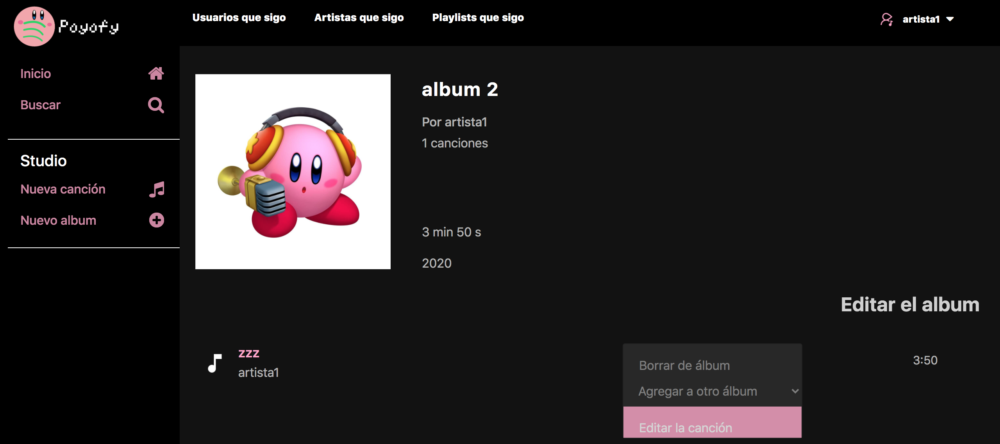

# Poyofy - clon de Spotify, pero rosado

Tarea 2 de ramo *Bases de Datos: INF 239*.  
Universidad Técnica Santa María  
2020-1

# Datos
- Anastasiia Fedorova  201873505-1  
<anastasiia.fedorova@sansano.usm.cl>

# Contenido
- [Dependencias y Stack](#dependencias-y-stack)
- [Ejecución](#ejecuci-n)
- [Registración](#registraci-n)
- [Sesión de usuario](#sesi-n-de-usuario)
- [Barra de navegación superior](#barra-de-navegaci-n-superior)
- [Busqueda](#busqueda)
- [Creación de playlists, albumes y canciones](#creaci-n-de-playlists--albumes-y-canciones)
- [Canciones favoritas](#canciones-favoritas)
- [Redacción de playlists, canciones y albumes](#redacci-n-de-playlists--canciones-y-albumes)
- [Perfíl de usuario y seguimiento](#perf-l-de-usuario-y-seguimiento)
- [Edición de la cuenta](#edici-n-de-la-cuenta)

# Dependencias y Stack
- PHP 7.4.8
- MySQL
- Javascript
- HTML
- CSS
- XAMPP para montar la máquina virtual y configurar localhost
- Sistema principal: MacOS Sierra 10.12.6

# Ejecución
- El contenido del repositorio debe estar ubicado en la carpeta T2 de htdocs
- Al acceder a cualquier página (ej. localhost:8080/T2/index.php) el usuario será redireccionado a la página de Log In o Sign Up, según el caso.

# Registración
Existen dos tipos de cuentas - cuenta Usuario o cuenta Artista. Para elegir el tipo de la cuenta, se debe utilizar el select de menu de registración. El tipo de cuenta es permanenente y no puede ser cambiado más tarde.

# Sesión de usuario
La sesión de usuario se inicializa a partir de login.php, una vez ingresados bien los datos según la base de datos.
Para cerrar la sesión, se puede utilizar el menu dropdown el topbar persistente, el botón en la sección Cuenta o al borrar la cuenta - en este caso, se destruye toda la información relacionada con el usuario (likes, playlists, canciones, etc).

# Barra de navegación superior
Permite acceder a vistas de usuarios seguidos, artistas seguidos o playlists seguidos. Cualquier usuario tiene estas vistas disponibles.

# Busqueda
Permite a cualquier usuario buscar sobre canciones, playlists y otras personas. Si no existe un registro parecido para alguna sección menciona, simplemente no será demostrada - por ejemplo, en este caso no existe ningún playlist con nombre parecido a "a".

Cualquier canción puede ser editada desde la busqueda - por ejemplo, el usuario puede agregarla a playlist o darle like.

# Creación de playlists, albumes y canciones
Los usuarios pueden crear los playlists ilimitados a través de un simple formulario:

Los artistas pueden crear las canciones y los albumes desde el Studio.

# Canciones favoritas 
Los usuarios tienen acceso en la barra izquierda a una vista de sus canciones favoritas. Las canciones son editables como en cualquier otra parte - es decir, se puede quitar el like (la canción al hacer refresh desaparecerá de la vista) o agregar la canción a algún playlist propio.

Los artistas en la barra izquierda tienen acceso a Studio - sus opciones permiten a los artistas crear nuevos albumes (inicialmente vacíos) y canciones.

# Redacción de playlists, canciones y albumes
Si el usuario actual es autor del playlist, tendrá visible el botón de editar - este permite acceder a una vista con un formulario.

Analógicamente, si el usuario es el artista y es autor de canción, tendrá visible el botón de editar - este permite acceder a una vista con un formulario.

Lo mismo para albumes.

# Perfíl de usuario y seguimiento
Existen dos distintas vistas de perfiles - para usuarios, se muestra el número de seguidores, botón de seguir o dejar de seguir (si no es el perfil del usuario actual) y los playlists creados.

Para artistas, se muestra la cantidad de seguidores, botón de seguir o dejar de seguir (si no es el perfil de artista actual), canciones y los albumes creados.

# Edición de la cuenta
En la barra lateral se presentan tres opciones nuevas. La primera permite ver los datos de usuario, su plan y la opción de log out.

La segunda permite cambiar el nombre o la dirección de correo del usuario - notar que no pueden existir correos repetidos en la base de datos.

La tercera permite cambiar la contraseña.

La cuarta permite eliminar la cuenta - en este caso se pierden todos los datos relacionados con el usuario actual.

